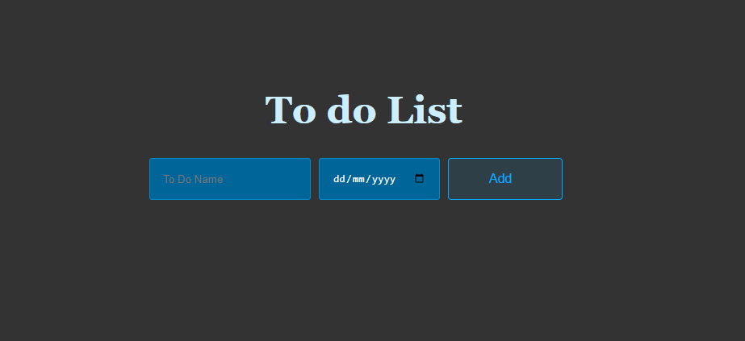

#To DO APP

Introduction of the project aim:
This is an app that lists To dos in a list

Technologies used:
HTML, CSS and vanilla Javascript
No NPM needed

Launch:
after cloning the repository you should be able to run Live server extension and be able to see the to do list UI

Use examples:
You should be able to add to dos to a list you add a name and a date.
once added you can delete the To Do from the list and you can toggle complete the to do it will show by the writing color change and the line through if complete is clicked the to do will be back on the list

future features:
the app at the moment does not store the To dos therefore adding the to do into the local storage and making it to locally hosted will be the next stage of this APP

updated on:28/02/2024
